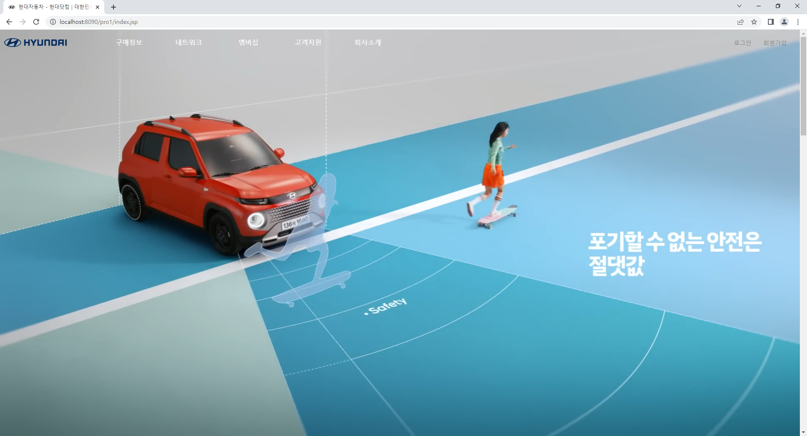
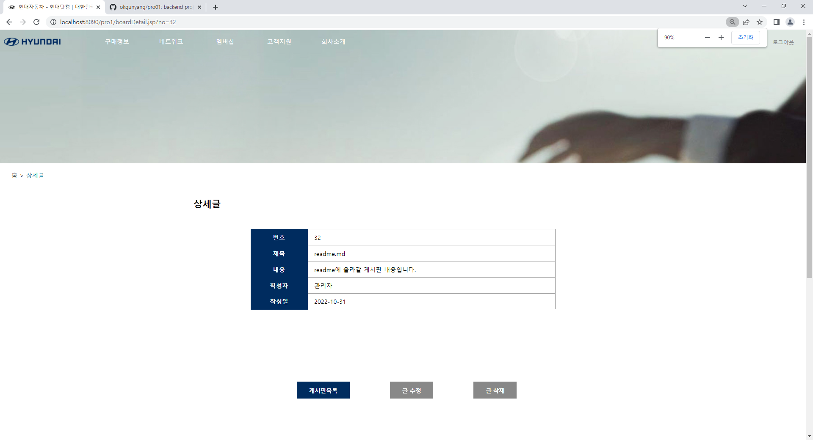

# 프로젝트
## 프로젝트 개요
"HYUNDAI"라는 기업을 주제로 웹사이트 설계 및 제작 프로젝트를 진행.
프론트엔드 부분은 페이퍼 프로토타입으로 사이트 내부의 사용성을 파악하고, html, css, javascript로 구성한다.
백엔드 부분은 jsp의 디렉티브, 데스크탑 웹 어플리케이션을 작성하며, 해당 프로젝트는 회원기능에 '회원가입','로그인','로그아웃','회원정보확인','회원정보수정','회원탈퇴','회원게시판 글 목록','글 상세보기','글 등록','글 수정','글 삭제' 등의 기능을 구현하고,
관리자는 일반 회원의 관리기능인 '회원 정보 수정', '회원 강제 탈퇴', '회원 통계', '글 관리 기능' 등을 구현한다.

## 프로젝트 기획

## 프로젝트 설계

## 기능 구현

